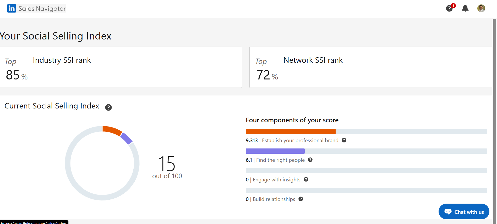

# LinkedIn Profile Improvement Activity

## Objective
Improve my LinkedIn profile and increase my LinkedIn SSI score.

## Completed Tasks
- Updated professional profile picture
- Added LinkedIn headline
- Completed About/Summary section
- Added Featured content
- Updated professional experience
- Added skills
- Requested recommendations
- Created a LinkedIn post

## SSI Comparison

Before:
- SSI Score: 00/100

After 1 Week:
- SSI Score: 85/100

## LinkedIn Profile
www.linkedin.com/in/abood-jamal-082700243

## Next Steps
- Continue sharing relevant content
- Engage with professionals
- Grow my network

